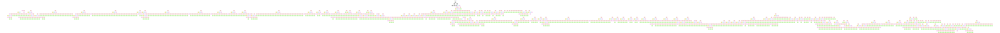

### Install

```console
$ pip install zbookmarks
```

### Usage

A simple python package for loading / dumping Chrome HTML bookmarks.
Born out of necessity to fix my own bookmarks.

```python
import zbookmarks

# Load
with open("chrome_bookmarks.html", "r") as f:
    bookmarks = zbookmarks.load_chrome(f.read())

# Print
print(bookmarks)

# Dump
with open("output.html", "w") as f:
    zbookmarks.dump_chrome(bookmarks, f)
```


### How it works

I made this package by examining my own Chrome bookmark files and extrapolating.
The general rules are:
- `dl` denotes a list of bookmark items and folders.
- `dt` denotes either a bookmark item or folder:
    - If it's a bookmark item, `dt` has a single `a` tag child, which gives the
      bookmark attributes (href, title, etc.).
    - If it's a bookmark folder, `dt` has 3 children:
        - A `h3` tag containing the folder attributes (title, etc.)
        - A `dl` tag containing the folder's contents.
        - A useless `p` child tag.

I found it easier to come up with these rules after visualizing the DOM tree of
a Chrome bookmarks file:



You can try it out on your own bookmark file by running:
```console
# You need to install graphviz (dot) in order to run the script
$ sudo apt-get install -y graphviz
$ poetry install
$ python3 scripts/visualize_dom.py <my_bookmarks_file.html>
```
